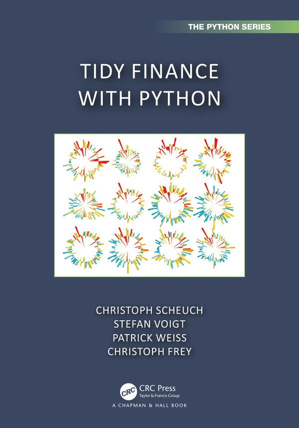
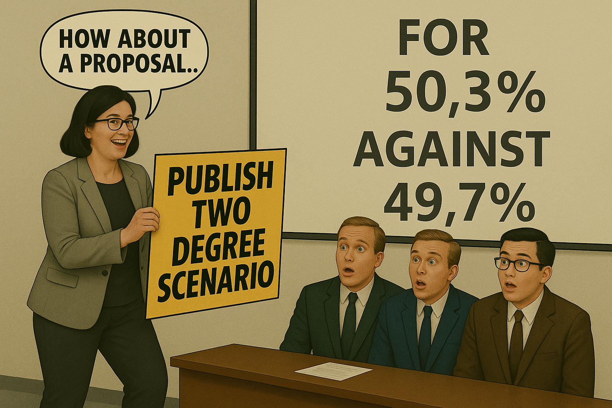

# Tidy Finance Blog

Experimental and external contributions based on *Tidy Finance with R*. [Contribute](https://www.tidy-finance.org/support.html) your ideas!

##### The legacy pandas edition of Tidy Finance with Python (unmaintained archive)

2 min

We migrated Tidy Finance with Python from pandas to polars and merged the R and Python editions into unified chapters. For reference, this post archives the complete…

Christoph Scheuch, Stefan Voigt, Patrick Weiss

Jun 19, 2026

##### High-Frequency Market Data: lobsteR and 20 Years of SPY on Hugging Face

8 min

Announcing lobsteR, an R package for LOBSTER high-frequency data, and seamless access to 20 years of 5-second SPY trading data via tidyfinance.

Stefan Voigt

Mar 15, 2026

##### Tidy Finance migrates from SQLite to Parquet

5 min

tidyfinance 0.4.0 is now on CRAN. Discover the new data download options it includes.

Christoph Scheuch, Stefan Voigt, Patrick Weiss, Christoph Frey

Feb 2, 2026

##### ISS Shareholder Proposals

21 min

Code for preparing ISS Voting Analytics data for further analysis on shareholder proposals

Alexander Pasler, Moritz Rodenkirchen

Jun 13, 2025

##### lobsteR package and high-frequency data

12 min

Introducing the lobsteR package and tidy cleaning procedures in R for LOBSTER high-frequency data

Stefan Voigt

Mar 15, 2025

##### Replicating Gu, Kelly & Xiu (2020)

20 min

A partial replication of the paper *Empirical Asset Pricing via Machine Learning* using R.

Stefan Voigt

Jun 17, 2024

![A vibrant outdoor scene under a clear, sunny sky, where a group of workers assemble a futuristic machine. The machine, situated in the center, features a complex design with gears and levers but no visible numbers or text. A colorful line chart representing an interest rate time series floats in the air, created by the machine. The chart consists of smooth, winding lines in various colors against a clear background. The workers are dressed in casual attire, and the landscape includes green grass and a few trees, contributing to the overall cheerful ambiance. Created with DALL-E 3.](./posts/cir-calibration/thumbnail.jpeg)

##### CIR Model Calibration using Python

10 min

Routine to calibrate the Cox-Ingersoll-Ross model

Yuri Antonelli

Apr 3, 2024

##### CRSP 2.0 Update

5 min

The highlights of the recent switch to CRSP 2.0 data

Patrick Weiss, Christoph Scheuch, Stefan Voigt, Christoph Frey

Mar 13, 2024

##### Tidy Market Microstructure

76 min

A beginner’s guide to market quality measurement in high-frequency data using R.

Björn Hagströmer, Niklas Landsberg

Jan 4, 2024

##### Using DuckDB with WRDS Data

9 min

Demonstrate the power of DuckDB and dbplyr with WRDS data.

Ian Gow

Dec 22, 2023

##### Comparing Fama-French Three vs Five Factors

7 min

An explanation for the difference in the size factors of Fama and French 3 and 5 factor data

Christoph Scheuch

Oct 2, 2023

##### Convert Raw TRACE Data to a Local SQLite Database

37 min

An R code that converts TRACE files from FINRA into a SQLite for facilitated analysis and filtering

Kevin Riehl, Lukas Müller

Jun 14, 2023

![Imagine a large, bustling research center. In the center, there&#039;s a colossal pile of papers, representing various studies and results. Around this pile, hundreds of researchers of diverse descents and genders are busily submitting their findings. Some are in lab coats, others in business casual attire, reflecting a variety of scientific and academic fields. The scene is a hive of activity, with researchers exchanging notes, discussing their work, and adding their papers to the pile. The background shows a modern research facility with computers, lab equipment, and bookshelves. Created with DALL-E 3.](./posts/nse-portfolio-sorts/thumbnail.jpeg)

##### Non-Standard Errors in Portfolio Sorts

39 min

An all-in-one implementation of non-standard errors in portfolio sorts

Patrick Weiss

May 10, 2023

##### Construction of a Historical S&P 500 Total Return Index

7 min

An approximation of total returns using Robert Shiller’s stock market data

Christoph Scheuch

Feb 15, 2023
